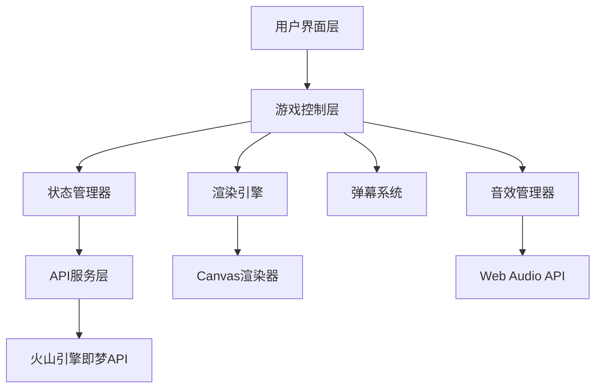

# 设计文档

## 概述

发泄情绪H5小游戏采用现代Web技术栈构建，使用Canvas进行游戏渲染，集成火山引擎即梦API实现图像变形效果。应用采用模块化架构，确保代码可维护性和性能优化。

## 架构

### 整体架构



### 技术栈选择

- **前端框架**: 原生JavaScript + HTML5 Canvas
- **构建工具**: Vite
- **样式**: CSS3 + CSS变量（支持响应式）
- **音频**: Web Audio API
- **图像处理**: Canvas API
- **API通信**: Fetch API
- **状态管理**: 自定义状态管理器

## 组件和接口

### 1. 核心游戏引擎 (GameEngine)

```typescript
interface GameEngine {
  // 游戏状态
  state: GameState;
  
  // 核心方法
  init(): void;
  start(): void;
  pause(): void;
  reset(): void;
  handleClick(x: number, y: number): void;
  update(deltaTime: number): void;
  render(): void;
}

interface GameState {
  isPlaying: boolean;
  clickCount: number;
  currentPhase: 'initial' | 'phase1' | 'phase2' | 'completed';
  uploadedImage: HTMLImageElement | null;
  transformedImages: HTMLImageElement[];
}
```

### 2. 图片管理器 (ImageManager)

```typescript
interface ImageManager {
  uploadImage(file: File): Promise<HTMLImageElement>;
  validateImage(file: File): boolean;
  resizeImage(image: HTMLImageElement, maxWidth: number, maxHeight: number): HTMLCanvasElement;
  transformImage(imageData: string, prompt: string): Promise<string>;
}
```

### 3. 弹幕系统 (DanmakuSystem)

```typescript
interface DanmakuSystem {
  messages: DanmakuMessage[];
  
  addMessage(text: string): void;
  update(deltaTime: number): void;
  render(ctx: CanvasRenderingContext2D): void;
  clear(): void;
}

interface DanmakuMessage {
  id: string;
  text: string;
  x: number;
  y: number;
  speed: number;
  color: string;
  fontSize: number;
  opacity: number;
}
```

### 4. 音效管理器 (AudioManager)

```typescript
interface AudioManager {
  sounds: Map<string, AudioBuffer>;
  
  loadSound(name: string, url: string): Promise<void>;
  playSound(name: string, volume?: number): void;
  setMasterVolume(volume: number): void;
  mute(): void;
  unmute(): void;
}
```

### 5. 特效系统 (EffectSystem)

```typescript
interface EffectSystem {
  effects: Effect[];
  
  addClickEffect(x: number, y: number): void;
  addShakeEffect(intensity: number): void;
  update(deltaTime: number): void;
  render(ctx: CanvasRenderingContext2D): void;
}

interface Effect {
  id: string;
  type: 'click' | 'shake' | 'particle';
  x: number;
  y: number;
  duration: number;
  elapsed: number;
  render(ctx: CanvasRenderingContext2D): void;
}
```

### 6. API服务 (APIService)

```typescript
interface APIService {
  transformImage(imageBase64: string, transformType: 'light' | 'heavy'): Promise<string>;
  handleAPIError(error: Error): void;
}

interface JimengAIConfig {
  apiKey: string;
  endpoint: string; // https://api.jimengai.com/image2image
  model: string;
  defaultParams: {
    strength: number;
    steps: number;
    guidance_scale: number;
    width: number;
    height: number;
  };
}
```

## 数据模型

### 游戏配置

```typescript
interface GameConfig {
  // 点击阈值
  phase1Threshold: number; // 50次
  phase2Threshold: number; // 100次
  
  // 弹幕配置
  danmakuMessages: string[];
  danmakuSpeed: number;
  danmakuFrequency: number;
  
  // 音效配置
  soundVolume: number;
  soundFiles: string[];
  
  // 视觉效果配置
  clickEffectDuration: number;
  shakeIntensity: number;
  
  // 图片配置
  maxImageSize: number; // 5MB
  supportedFormats: string[];
  canvasSize: { width: number; height: number };
}
```

### 即梦AI图生图API请求模型

```typescript
interface JimengImageTransformRequest {
  model: string; // 模型名称，可配置
  prompt: string; // 变形提示词
  image: string; // base64编码的原始图片
  strength: number; // 变形强度 0.1-1.0
  steps: number; // 推理步数，建议20-50
  guidance_scale: number; // 引导系数，建议7-15
  width?: number; // 输出宽度，可选
  height?: number; // 输出高度，可选
  seed?: number; // 随机种子，可选
}

interface JimengImageTransformResponse {
  success: boolean;
  message: string;
  data?: {
    image: string; // base64编码的结果图片
    seed: number; // 使用的随机种子
  };
  error?: string;
}

// 配置文件结构
interface APIConfig {
  jimengAI: {
    endpoint: string; // https://api.jimengai.com/image2image
    apiKey: string; // 从配置文件读取
    defaultModel: string; // 默认模型
    transformPrompts: {
      light: string; // 轻微变形的提示词
      heavy: string; // 严重变形的提示词
    };
    defaultParams: {
      strength: { light: number; heavy: number };
      steps: number;
      guidance_scale: number;
      width: number;
      height: number;
    };
  };
}
```

## 错误处理

### 错误类型定义

```typescript
enum ErrorType {
  UPLOAD_ERROR = 'UPLOAD_ERROR',
  API_ERROR = 'API_ERROR',
  NETWORK_ERROR = 'NETWORK_ERROR',
  VALIDATION_ERROR = 'VALIDATION_ERROR',
  RENDER_ERROR = 'RENDER_ERROR'
}

interface GameError {
  type: ErrorType;
  message: string;
  details?: any;
  timestamp: number;
}
```

### 错误处理策略

1. **文件上传错误**
   - 文件格式不支持：显示友好提示，引导用户选择正确格式
   - 文件过大：提示压缩或选择较小文件
   - 网络错误：提供重试机制

2. **API调用错误**
   - 网络超时：自动重试3次，失败后显示错误信息
   - API限流：显示等待提示，延迟重试
   - 服务不可用：显示备用方案或降级处理

3. **渲染错误**
   - Canvas不支持：显示浏览器兼容性提示
   - 内存不足：自动降低图片质量

## 测试策略

### 单元测试

- **ImageManager**: 测试图片上传、验证、缩放功能
- **DanmakuSystem**: 测试弹幕生成、移动、清理逻辑
- **AudioManager**: 测试音频加载、播放、音量控制
- **APIService**: 测试API调用、错误处理、重试机制

### 集成测试

- **游戏流程测试**: 完整的游戏流程从上传到变形
- **API集成测试**: 火山引擎API的真实调用测试
- **性能测试**: 高频点击下的性能表现
- **兼容性测试**: 不同浏览器和设备的兼容性

### 用户体验测试

- **响应式测试**: 不同屏幕尺寸下的布局适配
- **交互测试**: 触摸响应、手势识别
- **加载性能测试**: 首屏加载时间、资源加载优化
- **错误场景测试**: 网络断开、API失败等异常情况

### 性能优化策略

1. **图片优化**
   - 自动压缩上传图片
   - 使用WebP格式（支持的浏览器）
   - 图片懒加载和预加载

2. **渲染优化**
   - Canvas离屏渲染
   - 减少不必要的重绘
   - 使用requestAnimationFrame

3. **内存管理**
   - 及时清理不用的图片资源
   - 限制同时存在的弹幕数量
   - 音频资源复用

4. **网络优化**
   - API请求缓存
   - 资源CDN加速
   - 请求去重和合并

### 安全考虑

1. **文件上传安全**
   - 严格的文件类型验证
   - 文件大小限制
   - 恶意文件检测

2. **API安全**
   - API密钥安全存储
   - 请求频率限制
   - 输入参数验证

3. **用户隐私**
   - 上传图片不存储到服务器
   - 本地处理优先
   - 用户数据加密传输